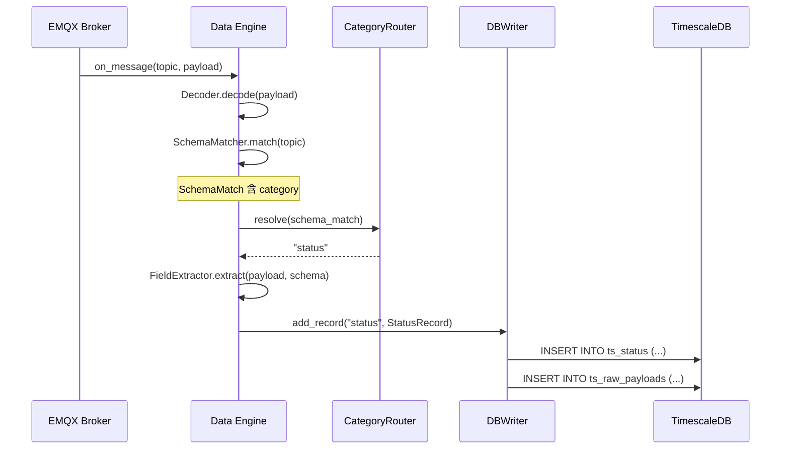

# Data Category 路由分流 — 跨 Agent 實作計畫

> **依據**：[ADR-001](adr/ADR-001-data-category-routing.md)  
> **決策**：方案 B 為主（Schema Type `category`）+ 方案 A fallback（Topic 命名慣例）  
> **建立日期**：2026-03-04  
> **建立者**：Data Engine Agent  

---

## 現狀盤點

### 已存在的 DB 目標表（`docker/init-db/03_timeseries.sql` + `04_measurement_state.sql`）

| 目標表 | 狀態 | 核心欄位 |
|---|---|---|
| `ts_telemetry` | ✅ 已存在 | `time, tag_id, value, value_text, value_json, quality` |
| `ts_status` | ✅ 已存在 | `time, tag_id, state, sub_state, mode, state_code` |
| `ts_alarms` | ✅ 已存在 | `time, tag_id, alarm_id, code, severity, message, state, value, threshold` |
| `ts_events` | ✅ 已存在 | `time, tag_id, event_id, event_code, result, details` |
| `ts_metrics` | ✅ 已存在 | `time, tag_id, metric_type, period, values, context` |
| `ts_measurements` | ✅ 已存在 | `time, tag_id, value, spec_upper/lower, target_value, result, lot_id, ...` |
| `ts_raw_payloads` | ✅ 已存在 | `time, mqtt_topic, payload, payload_size, schema_id` |

### 缺少的部分

| 缺口 | 負責 Agent | 說明 |
|---|---|---|
| `schema_types.category` 欄位 | **Backend Agent** | 決定此 Schema 的資料要寫到哪張表 |
| Schema Types CRUD API 支援 `category` | **Backend Agent** | Create/Update 時需接受 `category` |
| `SchemaMatch.category` 屬性 | Data Engine Agent | Pipeline 下游需要看到 category |
| `CategoryRouter` 路由抽象層 | Data Engine Agent | ADR-001 要求 |
| `DBWriter` Strategy Pattern 分流 | Data Engine Agent | 各表的 INSERT 語句不同 |

---

## 第一棒：Backend Agent 任務（B1 ~ B4）

> [!IMPORTANT]
> Backend Agent 請優先完成以下任務，Data Engine Agent 的工作依賴於此。

### 任務 B1：schema_types 加 `category` 欄位

**改動檔案**：`docker/init-db/02_namespace.sql`

在 `schema_types` 表加上 `category` 欄位：

```sql
ALTER TABLE schema_types
  ADD COLUMN IF NOT EXISTS category TEXT DEFAULT 'telemetry';
-- 合法值：telemetry, status, alarm, event, measurement, metrics
```

> [!IMPORTANT]
> 因為 DB volume 可能已有資料，建議用 `ALTER TABLE ... ADD COLUMN IF NOT EXISTS`，不要直接改 CREATE TABLE 語句。

---

### 任務 B2：更新 Schema Types CRUD API 支援 `category`

**改動檔案**：`backend/app/api/v1/schema_types.py`

- `POST /api/v1/schema-types`：接受 `category` 參數（可選，預設 `telemetry`）
- `PUT /api/v1/schema-types/{type_id}`：允許更新 `category`
- `GET /api/v1/schema-types`：回傳時包含 `category`
- 驗證 `category` 為合法值：`telemetry | status | alarm | event | measurement | metrics`

---

### 任務 B3：建立範例 Schema Types（各 category 一個）

在 DB 中插入測試用的範例 Schema Types，供 Data Engine E2E 驗證使用：

```yaml
# 範例 1: Telemetry
- type_name: "SMT_Printer_Telemetry"
  category: "telemetry"
  fields: [{name: "temperature", path: "$.temperature", type: "float", deadband: 0.5}]

# 範例 2: Status
- type_name: "Equipment_Status"
  category: "status"
  fields: [{name: "state", path: "$.state", type: "string"}, {name: "sub_state", path: "$.sub_state", type: "string"}]

# 範例 3: Alarm
- type_name: "Equipment_Alarm"
  category: "alarm"
  fields: [{name: "alarm_id", path: "$.alarm_id", type: "string"}, {name: "code", path: "$.code", type: "string"}, {name: "severity", path: "$.severity", type: "string"}, {name: "message", path: "$.message", type: "string"}]
```

> 這些範例可以用 API 或直接 SQL 建立，供 Data Engine Agent 的 E2E 測試使用。

---

### 任務 B4：更新 PROGRESS.md

- 記錄 `schema_types.category` 欄位已加
- 更新 API Contract Log 中 Schema Types 端點的說明

---

## 第二棒：Data Engine Agent 任務（D1 ~ D7）

> [!WARNING]
> 以下任務需在 Backend Agent 完成 B1~B3 之後才能開始。

### 任務 D1：SchemaMatch 加 `category` 屬性

**改動檔案**：`data-engine/src/schema_matcher.py`

```python
@dataclass
class SchemaMatch:
    node_id: int
    full_path: str
    persist_mode: str
    retention_days: int
    category: str = "telemetry"        # ← 新增
    schema_id: Optional[int] = None
    # ...其餘不變
```

- `_load_from_db()` 中的 SQL 查詢加上 `schema_types.category`
- 如果 `category IS NULL`，fallback 到 Topic 最末段名稱

---

### 任務 D2：建立 CategoryRouter 抽象層

**新增檔案**：`data-engine/src/category_router.py`

```python
class CategoryRouter:
    """
    決定一筆資料的 category。
    當前實作：schema_types.category > topic fallback > 'telemetry'
    未來可擴展：node.category_override > schema.category > topic fallback
    """
    VALID = {"telemetry", "status", "alarm", "event", "measurement", "metrics"}

    def resolve(self, schema_match: SchemaMatch) -> str:
        if schema_match.category and schema_match.category in self.VALID:
            return schema_match.category
        last_segment = schema_match.full_path.rsplit("/", 1)[-1].lower()
        if last_segment in self.VALID:
            return last_segment
        return "telemetry"
```

---

### 任務 D3：DBWriter Strategy Pattern 分流

**改動檔案**：`data-engine/src/db_writer.py`

目前 `DBWriter` 只有 `add_telemetry()` 和 `add_raw_payload()`。需要：

1. 新增各表對應的 Record 類別：`StatusRecord`, `AlarmRecord`, `EventRecord`, `MeasurementRecord`
2. 新增各表對應的 Buffer 和 flush 邏輯
3. 新增統一入口：`add_record(category: str, record)` 依 category 分派

```python
# 統一入口
def add_record(self, category: str, record):
    if category == "telemetry":
        self.add_telemetry(record)
    elif category == "status":
        self._status_buffer.append(record)
    elif category == "alarm":
        self._alarm_buffer.append(record)
    # ...
```

> [!IMPORTANT]
> 每張表的 INSERT 語句結構不同（欄位數、名稱），需為每張表寫獨立的 `_flush_xxx()` 方法。

---

### 任務 D4：Pipeline 整合 CategoryRouter

**改動檔案**：`data-engine/src/pipeline.py`

目前 Pipeline 的 `process()` 方法直接呼叫 `self._db_writer.add_telemetry()`。需要改為：

```python
category = self._category_router.resolve(schema)

# Field Extraction（不同 category 提取的欄位不同）
extracted = self._extractor.extract(payload, schema, receive_time)

# 依 category 組裝對應的 Record 類別
record = self._build_record(category, extracted, ...)
self._db_writer.add_record(category, record)
```

> [!WARNING]
> `FieldExtractor` 目前均回傳 `ExtractedValue`（適合 telemetry）。  
> 對於 `alarm` 和 `event`，可能需要從 payload 直接取值而非拆成個別 tag。
> Phase 1 可先讓所有 category 都用 `ExtractedValue`，後續再針對特殊 category 優化。

---

### 任務 D5：更新 E2E 驗證腳本

**改動檔案**：`data-engine/verify_e2e.py`

新增測試案例：
1. 建立 `category=status` 的 Schema + Node → 發送狀態 payload → 驗證寫入 `ts_status`
2. 建立 `category=alarm` 的 Schema + Node → 發送警報 payload → 驗證寫入 `ts_alarms`
3. 沒有設 category 的 Schema → 驗證 topic fallback 路由到 `ts_telemetry`

---

### 任務 D6：更新 Unit Tests

**改動檔案**：
- `test_schema_matcher.py`：驗證 `category` 載入與 fallback 邏輯
- `test_pipeline.py`：驗證不同 category 的路由行為
- [NEW] `test_category_router.py`：驗證 `CategoryRouter.resolve()` 的所有路徑

---

### 任務 D7：更新 PROGRESS.md + walkthrough.md

---

## 驗證計畫

### 自動化測試
```bash
# Unit Tests
pytest data-engine/tests/ -v

# E2E（需 Docker 環境）
./data-engine/run_e2e.sh
```

### 手動驗證
```bash
# 發送 Status payload
mosquitto_pub -t "Test/Line1/Printer/Status" -m '{"state":"running","sub_state":"normal"}'

# 檢查 ts_status
psql -U uns_admin -d uns_timeseries -c "SELECT * FROM ts_status ORDER BY time DESC LIMIT 5;"

# 發送 Alarm payload
mosquitto_pub -t "Test/Line1/Printer/Alarm" -m '{"alarm_id":"A001","code":"TEMP_HIGH","severity":"warning","message":"Temperature too high"}'

# 檢查 ts_alarms
psql -U uns_admin -d uns_timeseries -c "SELECT * FROM ts_alarms ORDER BY time DESC LIMIT 5;"
```

---

## 時序圖



---

## 相關文件

- [ADR-001: Data Category 路由決策](adr/ADR-001-data-category-routing.md)
- [platform_system_spec.md](platform_system_spec.md) §3.1, §5, §6
- [PROGRESS.md](../PROGRESS.md) — Agent Collaboration Contract
